# Mi primer diseño
- Brigitte Vanessa Quiñonez Capera
- Juan Sebastián Otálora Quiroga
- Carlos Fernando Quintero Castillo
---
Para este laboratorio, se tuvo el reto de a partir de un problema, diseñar un sistema de control que permitiera el uso de eficiente de energía eléctrica en una residencia a partir de unos requerimientos funcionales en la misma. En este se aplicaron técnicas de identificación de situaciones posibles desde lo simbólico hasta su abstracción a electrónica digital, aplicando conceptos cómo cajas negras, mapas de Karnaugth, compuertas lógicas y diagramas esquemáticos.

## Dominio comportamental (especificación y algoritmo)
### Caja negra
Después de realizar una valoración del problema, se obtuvo el siguiente resultado de entradas y salidas del sistema.

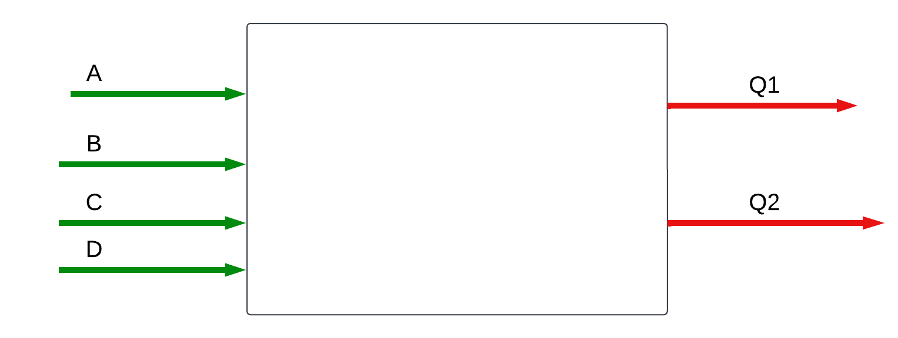

Donde las variables en verde son las entradas y las en rojo son las salidas, las cuales representan lo siguiente:

#### Entradas
- A → Sensor de luz optima (_Indica si la luz recibida es suficiente para que haya energía_)
- B → Sensor de carga de batería (_Indica si está cargada la batería)_
- C → Sensor de red elétrica (_Indica la presencia de red elécrica_) 
- Ei → Paro de emergencia (_Corta el suministro eléctrico en caso de activarse_)
#### Salidas
- CM→ Relé conmutador entre la red eléctrica y la red por baterías.
- M→ Relé conmutador de suministro eléctrico a la residencia

Cómo aclaración, el relé conmutador de sumnistro eléctrico se adaptará cómo un indacador de red eléctrica (discriminando el tipo)

### Tabla de verdad 

Realizando el análisis, se obtuvo la siguiente tabla de verdad:
<div align="center">

| **Ei** | **A** | **B** | **C** | **CM** | **M** |
|:------:|:-----:|:-----:|:-----:|:------:|:-----:|
|    0   |   X   |   1   |   X   |    0   |   1   |
|    0   |   1   |   0   |   1   |    1   |   1   |
|    0   |   1   |   0   |   0   |    0   |   1   |
|    0   |   0  |   0   |   1   |    1   |   1   |
|    0   |   0  |   0   |   0   |    0   |   0   |
|    1   |   X   |   X   |   X   |    X   |   0   |

</div>

### Diagrama de flujo


## Dominio físico inicial (circuito eléctrico):
### Representación circuital
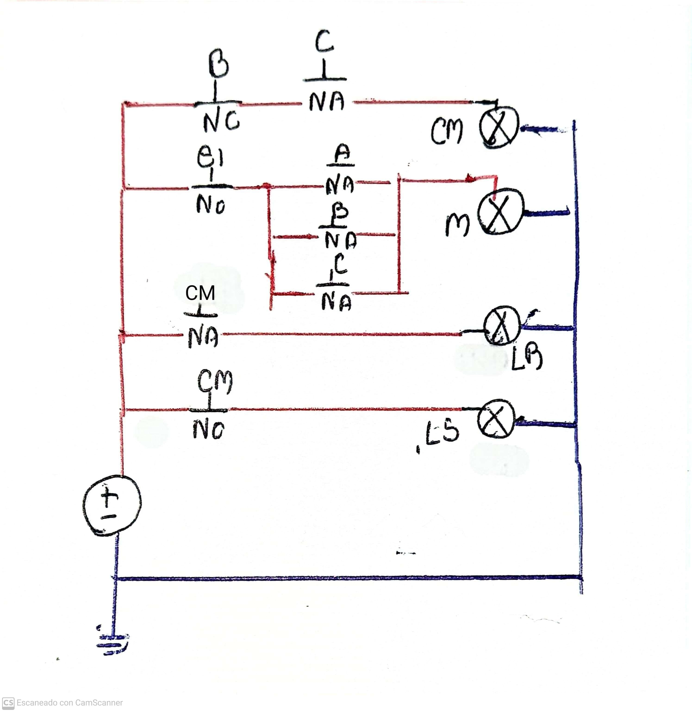
En donde tenemos los conmutadores CM y M, que represeantan el conmutador de red y el de eléctricidad respectivamente. Así mismo, se obtienen dos indicadores correspondientes a Luz de red eléctrica (LR) o luz solar(LS), que son puesto de manera simbólica para un mejor entendimiento del sistema.

Para recordar, se tiene que los interruptares NA corresponden a los normalmente abiertos y los NC a los normalmente cerrados.

### Representacion en ladder
Circuito representado en ladder:
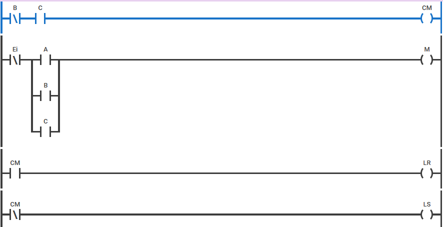

## Simulaciones ladder
- **Caso 1**

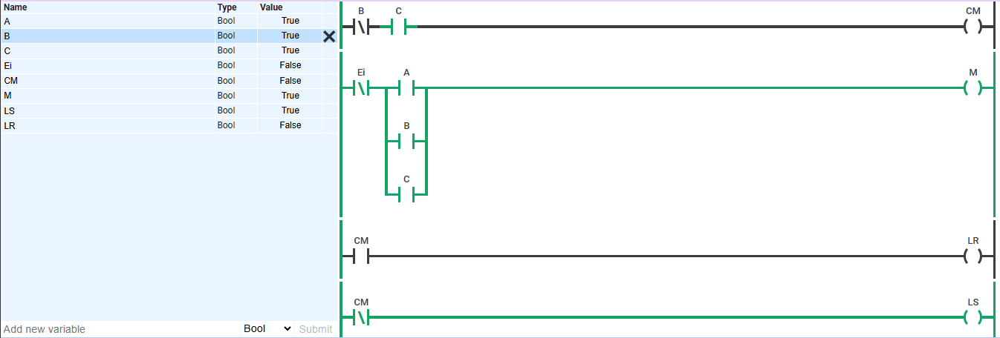

En este caso se prueba cómo al estar presente las baterias (B), sin importar cual sea el estado de los otros dos sensores (Ay B), la salida será la residencia energizado (M) mediante la red de baterías (LS).
- **Caso 2**

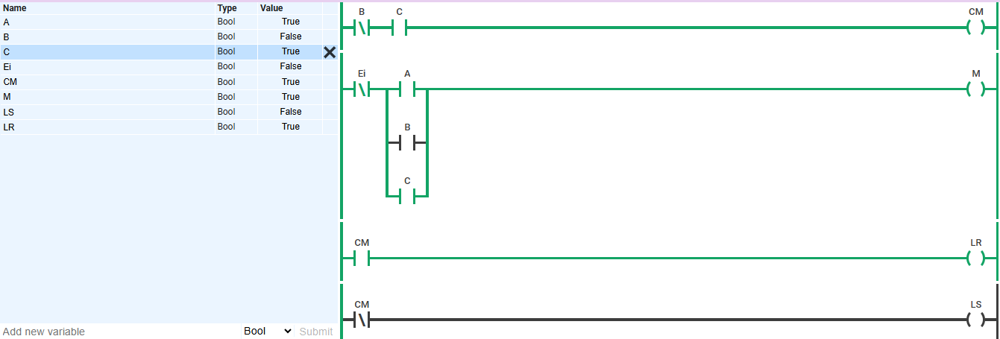
En este caso se muestra cómo a pesar de tener la presencia solar (A), al no haber presencia de baterías (B) pero si de red eléctica (C), la residencia estará energizada (M) pero mediante la red eléctrica (LR).
- **Caso 3**

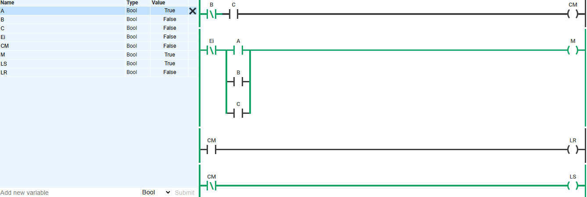

En este caso se muestra cómo al tener la presencia de una luz optima (A), la residencia se energizará (M) mediante la red de baterías o renovable. (LS)
- **Caso 4**

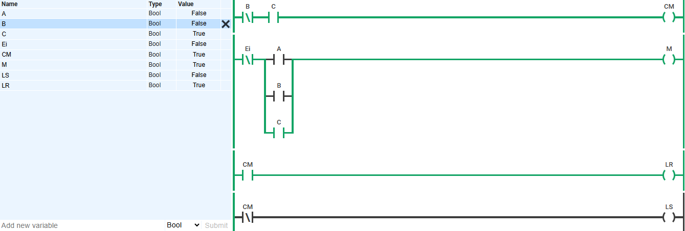
En este caso se evidencia cómo al únicamente tener presencia de red eléctrica (C), la residencia se energizará (M) por medio de esta red (LR).
- **Caso 5**

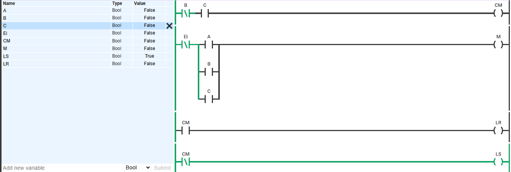

En este caso se muestra la ausencia de energía en la residencia al no tener presencia de ninguna fuente de energía (A, B y C)
- **Caso 6**

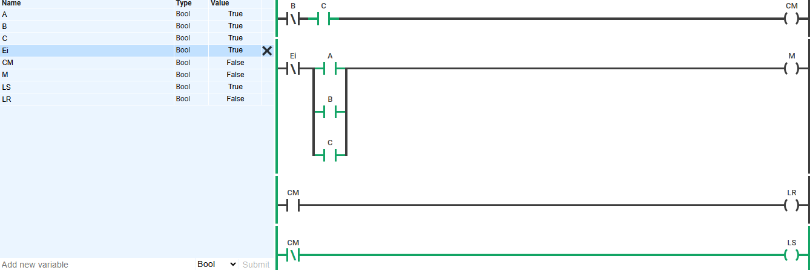
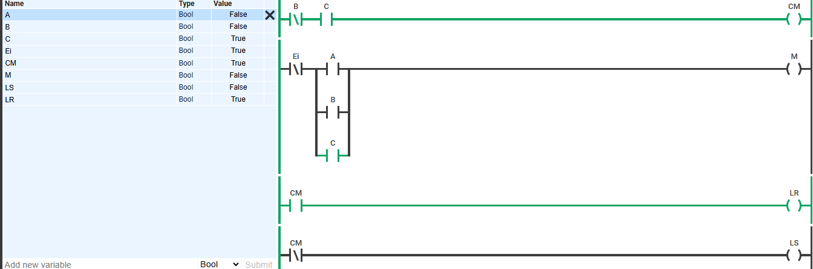
Por último, se tiene la situación en la cual se activa el interruptor de emergencia (Ei) en la energía (M) en la residencia se corta sin importar que red eléctrica estuviera sumnistrandola.

## Dominio estructural (red de compuertas lógicas)

### Ladder a compuertas lógicas
### Implementación en Digital
### Diagramas, tablas de verdad, simulaciones, mapas de Karnaugh, compuertas universales, LUT y suma de productos.
##  Descripción en lenguaje HDL (Hardware Description Language)

### top.v
En este apartado nos apoyamos en la herramienta Digital, la cual a partir de un circuito de compuertas propuesto, nos emite un archivo .v en donde relacionaremos entradas, salidas y compuertas. Este archivo será en que procese las señales de entrada que definimos en nuestro diagrama de caja negra y a partir del circuito de compuertas (_procesamiento de señales_), las relacione con las salidas  que le asignamos a nuestro sistema. 
```
module top  (
  input Ei,
  input A,
  input B,
  input C,
  output CM,
  output M
);
  assign CM = (~ B & C);
  assign M = ((A & ~ Ei) | (B & ~ Ei) | (C & ~ Ei));
endmodule
```

Aquí presenciamos como tendriamos 4 entradas o inputs, correspondientes a los 3 sensores y al boton de paro de emergencia, así como una dos salidas, una para el conmutador de red y la conmutación de presencia o no de luz. Asímismo se idenfican en la salida CM una compuerta AND entre la entrada C y la entrada B negada, en tanto que para nuestra salida M, tendriamos tres compuertas AND correspondientes a las entradas de los sensores cada uno con la negación del paro de emergencia y todo ello conjugado en una compuerta OR.

### Asignación de pines
Para la asignación de pines, se comprueba en la FPGA la ubicación de los pines y se asignan de manera arbitraria los pines para cada entrada y salida de nuestro circuito.

```
## ASIGNACIÓN DE PINES ##
#Entradas
set_location_assignment PIN_28 -to A
set_location_assignment PIN_31 -to B
set_location_assignment PIN_33 -to C
set_location_assignment PIN_38 -to Ei
#Salidas
set_location_assignment PIN_51 -to CM
set_location_assignment PIN_53 -to M
```

## Síntesis en FPGA (dominio físico final)

Para este apartado se tiene la implementación fisica del diseño, en donde se implementaron diferentes sensores (puestos en formas de pulsadores) y actuadores, en donde se tiene el relé conmutador, los diodos LEDs, resistencias y baterias, a continuación se muestra el diagrama de planeacion de la propuesta de circuito implementada.

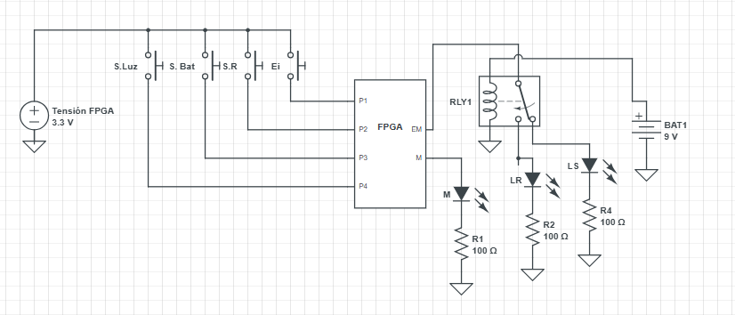

## Video de FPGA 

Puedes ver el video de la implementación de la FPGA [aquí](URL_DEL_VIDEO).
