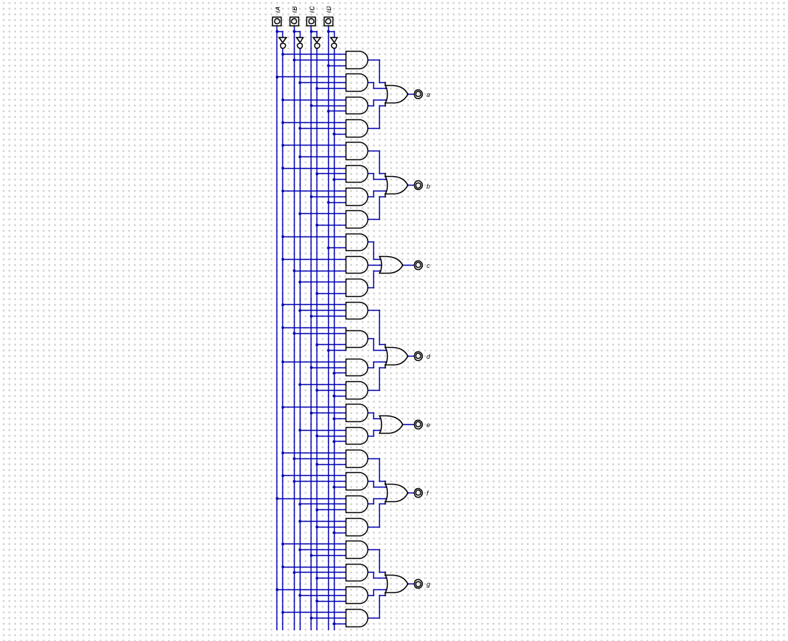

# Voltimetro
- Brigitte Vanessa Quiñonez Capera
- Juan Sebastián Otálora Quiroga
- Carlos Fernando Quintero Castillo

## Introducción

En esta práctica se desarrollará un voltímetro basado en FPGA, utilizando un circuito de rectificación y un transformador de 120V a 5V para la conversión de tensión. Además, se empleará el conversor analógico-digital ADC0808 para digitalizar la señal y permitir su procesamiento dentro de la FPGA. Los valores medidos serán visualizados en un display de 7 segmentos, permitiendo una lectura clara del voltaje.

El objetivo de la práctica es diseñar un sistema de medición de voltaje que integre distintos componentes electrónicos para la adquisición, procesamiento y visualización de datos. Para ello, se acondicionará la señal proveniente de la red eléctrica mediante un transformador y un circuito rectificador, seguido de la conversión digital con el ADC0808. Posteriormente, la FPGA interpretará los datos y controlará el display de 7 segmentos para mostrar el voltaje medido en tiempo real.

A través de esta práctica, se analizará el funcionamiento de cada uno de los componentes involucrados y se explorará la integración de hardware y software en sistemas de medición con dispositivos programables, enfatizando la conversión y visualización de señales analógicas en formato digital.

## Dominio comportamental (especificación y algoritmo)

El comportamiento de esta práctica se basa en la adquisición, procesamiento y visualización de una señal de voltaje de entrada utilizando una FPGA. Para ello, se emplean distintos módulos electrónicos que trabajan en conjunto para convertir una señal analógica de la red eléctrica en una lectura digital legible en un display de 7 segmentos.

### Reducción de voltaje:
La señal de 120V de corriente alterna (CA) se reduce a 5V CA mediante un transformador.

### Rectificación y acondicionamiento de señal:
Un circuito rectificador convierte la señal de CA en corriente continua pulsante.
Se puede incluir un filtro de condensador para suavizar la señal y reducir las ondulaciones antes del muestreo.

### Conversión analógico-digital (ADC0808):
La señal continua se introduce en el ADC0808, que la convierte en una señal digital de 8 bits.
El ADC trabaja mediante un proceso de muestreo y cuantificación, enviando los datos digitales a la FPGA.

### Procesamiento en la FPGA:
La FPGA recibe los datos digitales del ADC0808 y los procesa para interpretar el valor del voltaje medido.
Se realiza un mapeo adecuado de los valores binarios obtenidos a un formato decimal.

### Visualización en el display de 7 segmentos:
La FPGA controla un display de 7 segmentos, convirtiendo el dato procesado en señales de control para encender los segmentos correspondientes.
Esto permite mostrar el voltaje medido en tiempo real de forma clara y precisa.

### Caja negra

#### Entradas

Para el dispositivo, se recibira la señal directamente del tomacorriente , donde se recivira la onda AC.

#### Salidas

Se tendran tres salidas, 3 paneles 7 segmentos en los cuales se mostrara las unidades, decenas y centenas del la magnitud de la red.

### Tabla de verdad 
En la siguiente imagen se muestran unos de los casos del sistema, en resumen al ingresar la señal de 8bits saliente del ADC, estos seran transformados en la señal optima para ser presentado en los display 7 segmentos, por lo que primero se separan por unidades, decenas y centenas y estos valores con convertidos a base 10 y presentados en los displays.

## Dominio físico inicial (circuito eléctrico):

La primer fase del dispositivo es la toma de la señal de la red, se transforma a una señal rectificada cercana a los 5V, parasa por un diodo Zener con conexion shunt, de manera ue se regula la tension de salida, este valor DC ingresa al ADC para tener una salida de 8bits que ira a la FPGA.

## Dominio estructural (red de compuertas lógicas)

Gracias a la descriocion de la tabla de verdad, es posible determinar el circuito digital que pueda realizar la trtansformacion de la informacion para darle el uso deseado.

Ya con la informacion de esta manera, se convierte la señal por medio de un driver a 7 segmentos, para hacer uso de los 7 segmentos incorporados en la FPGA.

Por ultimo se simula con un panel 7 segmentos propio de DIGITAL, en donde se comprueba el correcto funcionamiento del dispositivo.

### Diagramas, tablas de verdad, simulaciones, mapas de Karnaugh, compuertas universales, LUT y suma de productos.

##  Descripción en lenguaje HDL (Hardware Description Language)

EL circuito descrito anteriormente se describe en el codigo .v, adjunto a esta entrega.

### Asignación de pines

## Síntesis en FPGA (dominio físico final)

## Video de FPGA 

Puedes ver el video de la implementación de la FPGA [aquí](https://www.youtube.com/watch?v=xz67W84lecs)
