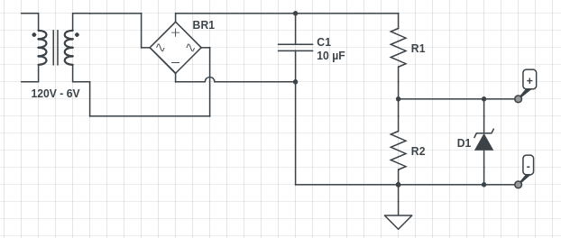
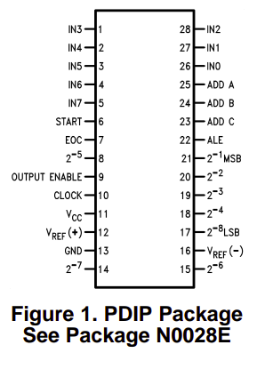
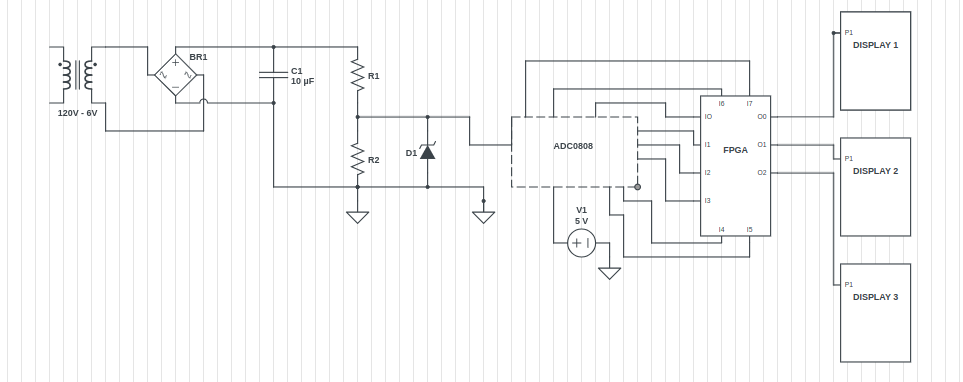

# Voltimetro
- Brigitte Vanessa Quiñonez Capera
- Juan Sebastián Otálora Quiroga
- Carlos Fernando Quintero Castillo

## Introducción

En esta práctica se desarrollará un voltímetro basado en FPGA, utilizando un circuito de rectificación y un transformador de 120V a 6V (RMS) para la conversión de tensión. Además, se empleará el conversor analógico-digital ADC0808 para digitalizar la señal y permitir su procesamiento dentro de la FPGA. Los valores medidos serán visualizados en un display de 7 segmentos, permitiendo una lectura clara del voltaje.

El objetivo de la práctica es diseñar un sistema de medición de voltaje que integre distintos componentes electrónicos para la adquisición, procesamiento y visualización de datos. Para ello, se acondicionará la señal proveniente de la red eléctrica mediante un transformador y un circuito rectificador, seguido de la conversión digital con el ADC0808. Posteriormente, la FPGA interpretará los datos y controlará el display de 7 segmentos para mostrar el voltaje medido en tiempo real.

A través de esta práctica, se analizará el funcionamiento de cada uno de los componentes involucrados y se explorará la integración de hardware y software en sistemas de medición con dispositivos programables, enfatizando la conversión y visualización de señales analógicas en formato digital.

## Dominio comportamental (especificación y algoritmo)

Se sabe que la tensión RMS que se emite en Colombia es de 120V, la cual al realizar la conversión a valor pico, nos entrega un valor de aproximada mente 170 Vp. De manera pŕactica se tiene que la tensión que debe entrar hacia el ADC es de 5V si tomamos en cuenta el máximo valor de registro de tensión pico, que serían 255, por ende es necesario realizar una equivalencia para saber qué tensión debe ir hacia el ADC teniendo en cuenta que la tensión a la que nos manejamos es de 170Vp y no 255, por lo que se debe implementar un circuito de acople el cual reciba la tensión del tranformador, la rectifique y por medio de un divisor de tensión realizado con un trimmer, obtener la tensión de entrada hacia el ADC. Además, para evitar daños por malas conexiones y/o cortocircuitos provocados por el error humano, se tendrá un diodo zenner de 5.1V para regular la tensión de salida en caso de fallas.
### Circuito de acople

#### Reducción de voltaje:
En primer lugar, se tiene que el transformador nos suministra un valor 6.2V RMS (una relación de transformación de 19.4 aproximadamente), lo que en valor pico sería aprximadamente **8.77Vp**.

#### Rectificación y acondicionamiento de señal:
Al pasar por el circuito rectificador, realizado por el dispositvo W04m, el cual es un puente rectificador y una vez realizado el filtro y suavizado de la señal gracias al condensador, se tiene que la tensión saliente es de aproximadamente 7.3V.

#### Equivalencia de tensión de salida
Se tiene que la referencia de tensión que maneja el ADC es de 5V, lo que se traduce que a dicha entrada mostraria 255Vp, lo cual no es lo que queremos, por ende realizamos un equivalencia de tensión junto con un divisor, para establecer la tensión que necesitamos. Realizando una regla de 3, se establece que la tensión que necesitamos es de 3.33V para una tensión de entrada de 170Vp, sabiendo que la tensión que tenemos hasta el momento es de **7.3V**, es necesario realizar un divisor de tensión, en donde tendremos en cuenta que el trimmer es de 100K ohmios por ende la suma de las resistencia es de 100K y que la tensión que cae entre R1 y tierra es de 7.3V, obteniendo lo siguiente:

$$V_{sal}=\frac{V*R2}{R1 + R2}$$

En donde que la resistencia R2 que es donde caen los 3.33V debe ser **45.62K ohmios**, la cual se ajusta en el trimmer.

### Conversión analógico-digital (ADC0808):

  

Para conversión en el ADC, lo que se realiza en primer lugar es seleccionar la entrada que vamos a usar por medio del multiplexor con los selectores ADD, los cuales ponemos a tierra asegurando que la entrada a usar va a ser la 0 a la cual van a ingresar los **3.33V** que obtuvimos anteriormente. Posteriormente fijamos nuestro valor de referencia en el ADC a 5V y lo alimentamos a la misma tensión. Luego ponemos en retroalimentación las salidas START y EOC, la cuales serán las encargadas de iniciar y finalizar el proceso de conversión y la ponemos de esta forma para sincronizar dicho proceso y asegurar que las muestras de datos se tomen y procesen en el momento adecuado. En cuanto a las salidas ALE y OE, las ponemos a 5V para asegurar que la lectura constante de información de las entradas analógicas y la que las salidas digitales del ADC esten activas y puedan leer la conversión realizada. Por último enviamos las salidas digitales del ADC hacia la FPGA para procesamiento de datos y poder desplegar la información en los 3 módulos 7 segmentos, los cuales mostraran la información en **centenas, decenas y unidades**.

#### Entradas

Para el dispositivo, se recibira la señal directamente del tomacorriente , donde se recivira la onda AC.

#### Salidas

Se tendran tres salidas, 3 paneles 7 segmentos en los cuales se mostrara las unidades, decenas y centenas del la magnitud de la red.
## Dominio estructural (red de compuertas lógicas)

### Diagramas, tablas de verdad, simulaciones, mapas de Karnaugh, compuertas universales, LUT y suma de productos.

###  Descripción en lenguaje HDL (Hardware Description Language)

EL circuito descrito anteriormente se describe en el codigo .v, adjunto a esta entrega.

### Asignación de pines

## Dominio físico inicial (circuito eléctrico):

### Esquema de montaje

### Video de implementación y montaje físico

Puedes ver el video de la implementación [aquí]()
