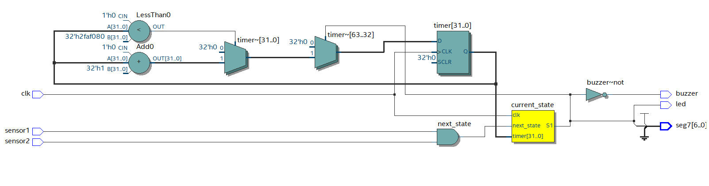
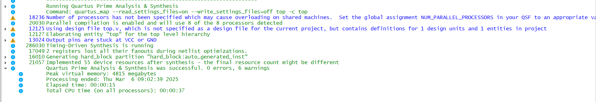
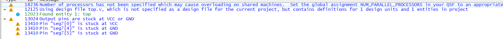

# Laboratorio 4

- Brigitte Vanessa Quiñonez Capera
- Juan Sebastián Otálora Quiroga
- Carlos Fernando Quintero Castillo

## Introducción

Este proyecto implementa un sistema de monitoreo en una FPGA, utilizando un sensor de vibración y un sensor de movimiento para detectar anomalías en entornos industriales o de seguridad. La FPGA procesará las señales en tiempo real, permitiendo una respuesta rápida ante eventos críticos. La comunicación con un PC mediante UART facilitará la visualización y el análisis de los datos recopilados, optimizando la eficiencia y confiabilidad del sistema.

## Dominio comportamental (especificación y algoritmo)

El dominio comportamental de este sistema se centra en la detección y alerta de eventos mediante la combinación de sensores de vibración y movimiento. Cada sensor actúa como una entrada digital a la FPGA, activándose cuando se detecta una vibración o un movimiento significativo. Si cualquiera de los sensores se activa de manera individual, el sistema registra el evento, pero si ambos sensores se activan simultáneamente, se genera una respuesta combinada. En este caso, el sistema activa una salida sonora, como una alarma, y visualiza un código de advertencia en un display de 7 segmentos. Esta lógica garantiza una respuesta rápida y efectiva ante posibles situaciones anómalas, proporcionando un sistema de monitoreo confiable y en tiempo real.

### Procesamiento en la FPGA:

El sistema recibe como entradas las señales provenientes de un sensor de vibración y un sensor de movimiento, los cuales generan niveles lógicos según la detección de eventos. Estas señales son procesadas por una máquina de estados implementada en la FPGA, que evalúa las condiciones de activación de los sensores y determina el estado del sistema. Dependiendo de la combinación de entradas, la máquina de estados activa las salidas correspondientes, como una alerta sonora y una visualización en un display de 7 segmentos cuando ambos sensores están activos simultáneamente.

Para facilitar el monitoreo remoto, los estados de salida del sistema se serializan y se transmiten a través del puerto UART integrado en la FPGA. Esta información puede ser recibida y visualizada en una consola de PC, permitiendo un análisis en tiempo real de los eventos detectados. De este modo, el sistema no solo ofrece una respuesta inmediata a través de sus salidas físicas, sino que también proporciona un medio de supervisión y registro de datos para su análisis posterior.

### Caja negra


#### Entradas

Al dispositivo ingresan las señales del sensor de vibracion y del sensor de movimiento, estos envian un pulso al momento de recibir estimulacion externa y se conectan directamente a la FPGA sin algun adaptador extra.

#### Salidas

Consisten en una salida sonora de alerta, ademas de un aviso en panel 7 segmentosa de manra que alertara en informara al usuario de movimientos en el entorno.

### Tabla de verdad 


## Dominio físico:

El dominio físico del dispositivo está compuesto por una FPGA Cyclone IV, encargada de gestionar las señales de entrada y controlar las salidas. Los sensores de vibración y movimiento están conectados directamente a la FPGA a través de pines GPIO, funcionando con niveles lógicos compatibles. Las salidas incluyen un buzzer para la alerta sonora y un display de 7 segmentos para la visualización de estados, ambos controlados mediante señales digitales generadas por la FPGA.

Dado que se trata de un primer prototipo con una construcción tosca, el sistema está montado sobre una placa de pruebas (protoboard) o un PCB básico con cableado expuesto, sin una carcasa protectora ni optimización en la disposición de los componentes. La comunicación con la consola del PC se realiza a través del puerto UART, utilizando un convertidor USB-UART para la transmisión de datos. Este diseño inicial permite validar el funcionamiento lógico del sistema antes de una futura optimización en términos de tamaño, consumo y robustez.

## Dominio estructural (red de compuertas lógicas)

Acontinuacion se presenta el diagrama RTL, en donde se puede evidenciar el uso de una maquina de estados de manera que active los modulos para las salidas adecuados.



### Diagramas, tablas de verdad, simulaciones, mapas de Karnaugh, compuertas universales, LUT y suma de productos.


##  Descripción en lenguaje HDL (Hardware Description Language)
### Módulo TOP
```
module top(
    input clk,          // Reloj del sistema
    input sensor1,      // Entrada del sensor 1
    input sensor2,      // Entrada del sensor 2
    output reg led,     // Salida para el LED
    output reg buzzer,  // Salida para el buzzer
    output reg [6:0] seg7 // Salida 7 segmentos (a-g)
);

// Definición de estados
parameter S0 = 2'b00;
parameter S1 = 2'b01;
parameter S2 = 2'b10;

// Registros de estado con inicialización
reg [1:0] current_state = S0;  // Inicializado en S0
reg [1:0] next_state;

// Temporizador con inicialización
parameter TIMER_LIMIT = 50_000_000;
reg [31:0] timer = 0;          // Inicializado en 0

// Codificación 7 segmentos
parameter SEG_0 = 7'b0000001;
parameter SEG_1 = 7'b1001111;

// Lógica de secuencia (sin reset)
always @(posedge clk) begin
    current_state <= next_state;
    
    // Control del temporizador
    if(current_state == S1) begin
        timer <= (timer < TIMER_LIMIT) ? timer + 1 : 0;
    end else begin
        timer <= 0;
    end
end

// Lógica de transición de estados (sin cambios)
always @(*) begin
    case(current_state)
        S0: next_state = (sensor1 && sensor2) ? S1 : S0;
        S1: next_state = (timer >= TIMER_LIMIT) ? S2 : S1;
        S2: next_state = (sensor1 && sensor2) ? S1 : S0;
        default: next_state = S0;
    endcase
end

// Lógica de salida (sin cambios)
always @(*) begin
    case(current_state)
        S0: {led, buzzer, seg7} = {1'b0, 1'b1, SEG_0};
        S1: {led, buzzer, seg7} = {1'b1, 1'b0, SEG_1};
        S2: {led, buzzer, seg7} = {1'b0, 1'b1, SEG_0};
        default: {led, buzzer, seg7} = {1'b0, 1'b1, SEG_0};
    endcase
end

endmodule
```

### Implementación UART

```
  // ============================
  // Lógica de transmisión UART
  // ============================
  
  // Señales para la transmisión UART
  reg [7:0] tx_data = 8'd0;
  reg tx_start = 0;
  wire tx_busy;
  wire baud_clk;
  
  // Cadena "intruso" (códigos ASCII)
  // i = 0x69, n = 0x6E, t = 0x74, r = 0x72, u = 0x75, s = 0x73, o = 0x6F
  reg [7:0] intruso [0:6];
  initial begin
      intruso[0] = 8'h69;
      intruso[1] = 8'h6E;
      intruso[2] = 8'h74;
      intruso[3] = 8'h72;
      intruso[4] = 8'h75;
      intruso[5] = 8'h73;
      intruso[6] = 8'h6F;
  end
  
  reg [2:0] char_index = 0;
  reg sending = 0;  // Flag para indicar si se está transmitiendo la cadena

  // Instancia del divisor de frecuencia para generar baud_clk (ajusta FREQ_IN según tu clk)
  divFreq #(
      .FREQ_IN(50000000),  // Ejemplo: 50 MHz
      .FREQ_OUT(9600)
  ) baud_inst (
      .CLK_IN(clk),
      .CLK_OUT(baud_clk)
  );
  
  // Instancia del módulo UART TX
  uart_tx_8n1 uart_tx_inst (
      .baud_tick(baud_clk),
      .tx_data(tx_data),
      .tx_start(tx_start),
      .rst( (current_state == S0) ),  // Puedes reiniciar el transmisor al salir de S1
      .tx(tx),
      .tx_busy(tx_busy)
  );
  
  // Máquina de estados para el envío de la palabra "intruso"
  always @(posedge clk) begin
      if (current_state == S1) begin
          if (!sending) begin
              // Inicia la transmisión al entrar en S1
              sending <= 1;
              char_index <= 0;
              tx_data <= intruso[0];
              tx_start <= 1;  // Pulso para iniciar la transmisión del primer carácter
          end else begin
              tx_start <= 0;  // Después del pulso inicial, mantener en 0
              // Si el transmisor no está ocupado, enviar el siguiente carácter
              if (!tx_busy && sending) begin
                  if (char_index < 6) begin
                      char_index <= char_index + 1;
                      tx_data <= intruso[char_index + 1];
                      tx_start <= 1;  // Genera un nuevo pulso para transmitir el siguiente carácter
                  end else begin
                      // Se terminó de enviar la cadena
                      sending <= 0;
                  end
              end
          end
      end else begin
          // Si no estamos en S1, se desactiva la transmisión
          sending <= 0;
          tx_start <= 0;
      end
  end
  
endmodule

```
#### Divisor de frecuencia
```
// filename: divFreq.v
module divFreq #(
    parameter integer FREQ_IN = 50000000,
    parameter integer FREQ_OUT = 9600,
    parameter integer INIT = 0
) (
    // Inputs and output ports
    input CLK_IN,
    output reg CLK_OUT = 0
);

  localparam integer COUNT = (FREQ_IN / FREQ_OUT) / 2;
  localparam integer SIZE = $clog2(COUNT);
  localparam integer LIMIT = COUNT - 1;

  // Declaración de señales [reg, wire]
  reg [SIZE-1:0] count = INIT;

  // Descripción del comportamiento
  always @(posedge CLK_IN) begin
    if (count == LIMIT) begin
      count   <= 0;
      CLK_OUT <= ~CLK_OUT;
    end else begin
      count <= count + 1;
    end
  end
endmodule
```
#### Modulo UART8N1
```
// `include "./divFreq.v"
`include "./uart_rx_8n1.v"
`include "./uart_tx_8n1.v"

module uart_8n1 #(
    parameter integer FREQ_IN  = 50000000,
    parameter integer FREQ_OUT = 9600
) (
    // Inputs and output ports
    input  wire       hclk,      // Baud tick generado externamente
    input  wire       rst,       // Reset
    input  wire       rx,        // Línea de recepción
    output wire       tx,        // Línea de transmisión
    input  wire [7:0] tx_data,   // Dato a transmitir
    input  wire       tx_start,  // Señal para iniciar transmisión
    output wire       tx_busy,   // Indicador de transmisor ocupado
    output wire [7:0] rx_data,   // Dato recibido
    output wire       rx_ready   // Indicador de dato recibido
);

  // Declaración de señales [reg, wire]
  wire baud_clk;

  // Descripción del comportamiento
`ifdef DEBUG
  assign baud_clk = hclk;
`else
  divFreq #(
      .FREQ_IN (FREQ_IN),
      .FREQ_OUT(FREQ_OUT)
  ) baud (
      .CLK_IN (hclk),
      .CLK_OUT(baud_clk)
  );
`endif

  uart_tx_8n1 uart_tx (
      .baud_tick(baud_clk),
      .rst(rst),
      .tx(tx),
      .tx_data(tx_data),
      .tx_start(tx_start),
      .tx_busy(tx_busy)
  );

  uart_rx_8n1 uart_rx (
      .baud_tick(baud_clk),
      .rst(rst),
      .rx(rx),
      .rx_data(rx_data),
      .rx_ready(rx_ready)
  );

endmodule
```
#### Módulo transmisor de la información 
```
module uart_tx_8n1 (
    input  wire       baud_tick,   // Baud tick generado externamente
    input  wire [7:0] tx_data,     // Dato a transmitir
    input  wire       tx_start,    // Señal para iniciar transmisión
    input  wire       rst,         // Reset
    output reg        tx = 1,      // Línea de transmisión
    output reg        tx_busy = 0  // Indicador de transmisor ocupado
);
  // Transmisor
  reg [9:0] tx_shift_reg;  // Start bit + 8 bits de datos + Stop bit
  reg [3:0] tx_bit_count;

  // Transmisor
  always @(posedge baud_tick or posedge rst) begin
    if (rst) begin
      tx <= 1'b1;  // Línea inactiva IDLE
      tx_busy <= 0;
      tx_shift_reg <= 10'b1111111111;
      tx_bit_count <= 0;
    end else if (tx_start && !tx_busy) begin
      tx_shift_reg <= {1'b1, tx_data, 1'b0};  // Stop + Data + Start
      tx_bit_count <= 0;
      tx_busy <= 1;
    end else if (tx_busy) begin
      tx <= tx_shift_reg[0];
      tx_shift_reg <= {1'b1, tx_shift_reg[9:1]};  // Shift
      tx_bit_count <= tx_bit_count + 1;
      if (tx_bit_count == 10) begin
        tx_busy <= 0;  // Transmisión completa
      end
    end
  end
endmodule
```
### Asignación de pines
```
##  CONFIGURACIÓN DE PROYECTO agregar en el archivo top.qsf ##

set_global_assignment -name FAMILY "Cyclone IV E"
set_global_assignment -name DEVICE EP4CE10E22C8
set_global_assignment -name TOP_LEVEL_ENTITY top
set_global_assignment -name PROJECT_OUTPUT_DIRECTORY build

# def clk
set_location_assignment PIN_23 -to clk

# Entradas
set_location_assignment PIN_32 -to sensor1   # Sensor 1
set_location_assignment PIN_31 -to sensor2   # Sensor 2

# Salidas
set_location_assignment PIN_30 -to led       # LED
set_location_assignment PIN_141 -to buzzer    # Buzzer
set_location_assignment PIN_50 -to seg7[0]
set_location_assignment PIN_44 -to seg7[1]
set_location_assignment PIN_54 -to seg7[2]
set_location_assignment PIN_51 -to seg7[3]
set_location_assignment PIN_52 -to seg7[4]
set_location_assignment PIN_55 -to seg7[5]
set_location_assignment PIN_58 -to seg7[6]
set_location_assignment PIN_114 -to tx

set_global_assignment -name LAST_QUARTUS_VERSION "23.1std.1 Lite Edition"

set_global_assignment -name PARTITION_NETLIST_TYPE SOURCE -section_id Top
set_global_assignment -name PARTITION_FITTER_PRESERVATION_LEVEL PLACEMENT_AND_ROUTING -section_id Top
set_global_assignment -name PARTITION_COLOR 16764057 -section_id Top
set_instance_assignment -name PARTITION_HIERARCHY root_partition -to | -section_id Top
```


## Síntesis en FPGA (dominio físico final)

  Se presenta la salida de consola al momento de la sistesis del codigo, se puede evidenciar que el uso de la memoria 

  

  Se presentan 6 advertencias, estas re refieren principalmente al uso:


Estas advertencias indican conexiones a VDD o a GND de algunos leds del 7 segmentos, estos estan contemplados y no representan un inconventiente en el funcionamiento del dispositivo. esto se encuentra contemplado


## Video de FPGA 

Puedes ver el video de la implementación de la FPGA [aquí](https://www.youtube.com/shorts/NIg7JnyLPqM)
